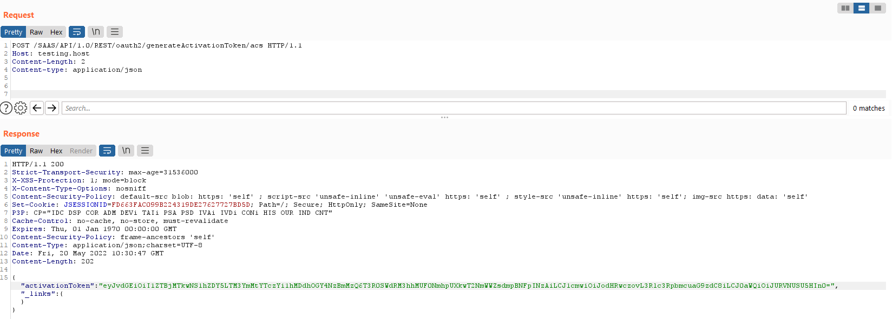
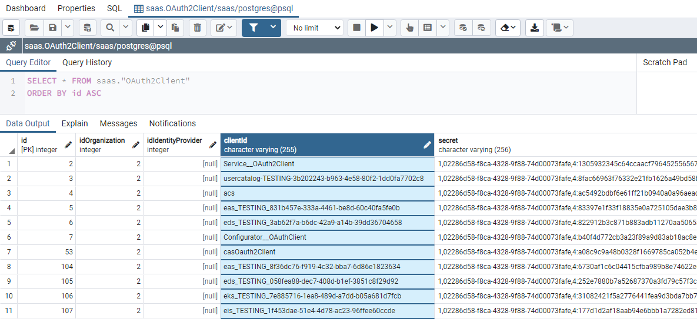
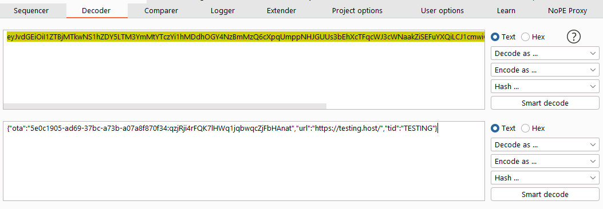
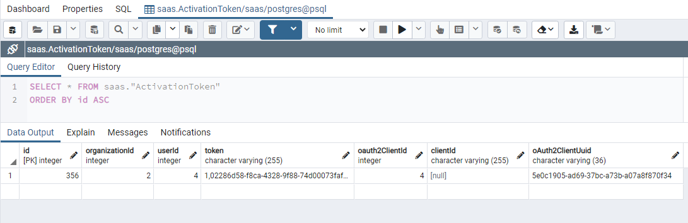
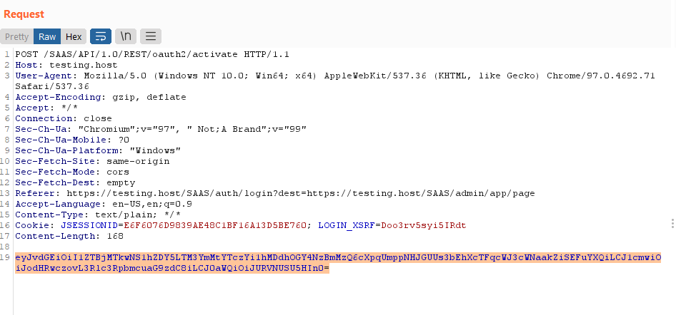
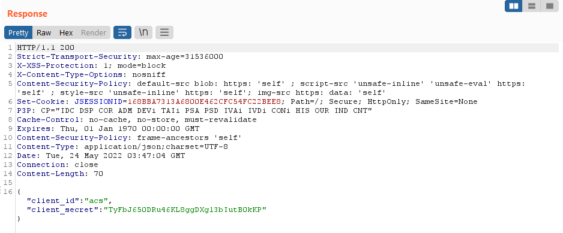
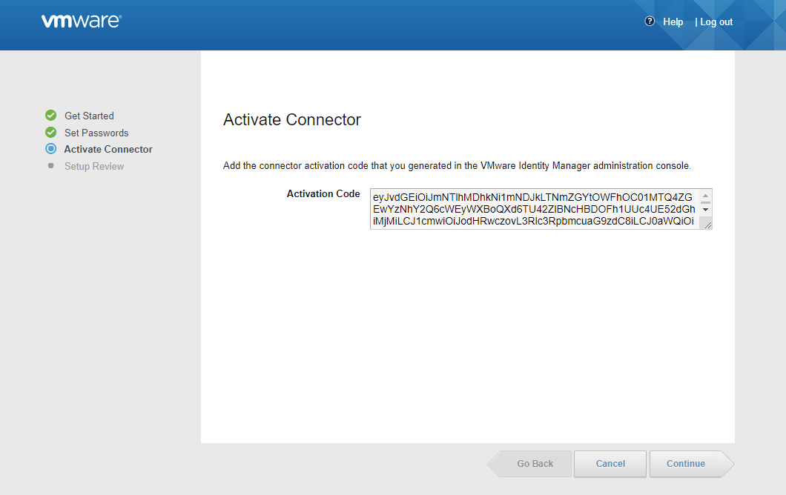

# CVE-2022-22955 OAuth2 ACS Authentication Bypass Vulnerabilities (Vmware ONE Access)

## Tổng quan
Workspace ONE Access (mô hình cung cấp không gian làm việc dưới dạng một dịch vụ) cung cấp tính năng xác thực đa yếu tố, đăng nhập một lần và truy nhập có điều kiện cho SaaS, các ứng dụng web và mobile. CVE-2022-22955 là lỗ hổng có trên OAuth2 ACS framework, cho phép người dùng có thể bypass xác thực phía ứng dụng
Các phiên bản ảnh hưởng

- VMware Workspace ONE Access (Access): v21.08.0.1, 21.08.0.0, 20.10.0.1, 20.10.0.0
- VMware Identity Manager (vIDM): v3.3.6, 3.3.5, 3.3.4, và 3.3.3
- VMware vRealize Automation (vRA): v8.x và 7.6
- VMware Cloud Foundation (VCF): v4.x và 3.x
- vRealize Suite Lifecycle Manager: 8.x

## Phân tích lỗi
Quay lại với script Workaround fix lỗi
```python
saas_web_xml='/opt/vmware/horizon/workspace/webapps/SAAS/WEB-INF/web.xml'
```
```python
oauth2_security_constraint='''
<security-constraint>
	<web-resource-collection>
		<web-resource-name>blocks generateActivationToken url</web-resource-name>
		<url-pattern>/API/1.0/REST/oauth2/generateActivationToken/*</url-pattern>
        <url-pattern>/API/1.0/REST/system/dbCheck</url-pattern>
        <http-method>POST</http-method>
	</web-resource-collection>
	<auth-constraint />
</security-constraint>
'''
```
```python
def apply_workaround(filename, element):
    with open(filename, encoding='UTF-8') as f:
        tree = ET.parse(f)
        ET.register_namespace('', 'http://java.sun.com/xml/ns/javaee')
        root = tree.getroot()
        subelement=ET.fromstring(element)
        root.append(subelement)
        tree.write(filename)

apply_workaround(saas_web_xml, oauth2_security_constraint)
```
Dựa vào tên của lỗi (OAuth2 ACS Authentication Bypass), có thể đây là cách để khắc phục và endpoint `/API/1.0/REST/oauth2/generateActivationToken/*` có liên quan đến quá trình khai thác.

Kiểm tra source code của endpoint này tại package `com.vmware.horizon.connector.management.rest.resource.connector` class `ConnectorResource`
```java
@POST
@Produces({"application/vnd.vmware.horizon.manager.connector.management.connectorActivationToken+json"})
@Path("/generateactivationtoken")
@TypeHint(ConnectorActivationToken.class)
public Response generateActivationToken(@PathParam("id") UUID connectorId)
{
  String activationTokenUrl = this.urlBuilder.buildServerUrl(this.request, getOrgName().toLowerCase(), "/");
  try
  {
    activationToken = this.connectorService.createBase64ActivationTokenStr(getOrgName(), connectorId, activationTokenUrl);
  } catch (ConnectorNotFoundException e) { String activationToken;
    throw new WebApplicationException(e, Response.Status.NOT_FOUND);
  } catch (ActivationTokenNotFoundException|ActivationTokenCreationException e) {
    throw new WebApplicationException(e, Response.Status.INTERNAL_SERVER_ERROR); }
  String activationToken;
  ConnectorActivationToken connectorActivationToken = new ConnectorActivationToken(activationToken);
  return Response.ok(connectorActivationToken).build();
}  
```
Endpoint generateActivationToken nhận đầu vào là 1 biến `connectorId`, kiểm tra trong database xem có `clientId` nào trùng giá trị hay không. Nếu có sẽ trả về token đăng nhập

`clientId` luôn tồn tại những giá trị mặc định đều có scope là `system admin` như
- acs
- Service_OAuth2Client
- casOauth2Client



&rarr; <mark>Có thể lấy được token của `system admin` mà không cần bất kì quyền nào</mark>

Token đăng nhập được encode, lưu giá trị vào bảng `ActivationToken` 



Token sau khi được tạo sẽ được gửi tới endpoint `/API/1.0/REST/oauth2/generateActivationToken/active`. Endpoint này kiểm tra token hợp lệ bằng cách so sánh với giá trị trong bảng `ActivationToken`, nếu hợp lệ sẽ trả về user và password

```java
@POST
@ResponseStatus(HttpStatus.OK)
@Path("/activate")
@Consumes({"application/vnd.vmware.horizon.manager.connector.management.connectorinstance+json"})
@Produces({"application/vnd.vmware.horizon.manager.connector.management.connector+json"})
@TypeHint(ConnectorOAuth2ClientDetails.class)
public Response activateConnectorAgainstInstance(@PathParam("id") UUID connectorId, @Nonnull ConnectorInstance connectorInstance) {
    String suiteToken = this.frontEndService.getValidatedSuiteTokenStringFromRequest(this.request);
    String activationTokenUrl = this.urlBuilder.buildServerUrl(this.request, this.getOrgName().toLowerCase(), "/");
    String connectorInstanceId = connectorInstance.getConnectorInstanceTO().getInstanceId();

    try {
        ConnectorTO updatedConnector = this.connectorService.activateConnectorOnInstance(this.getOrgName(), suiteToken, connectorId, connectorInstanceId, activationTokenUrl);
        return Response.ok(this.connectorsConverter.toConnector(updatedConnector, this.getOrgName())).build();
    } catch (ConnectorActivationException var7) {
        logger.error("Error activating connector uuid: " + connectorId + " instanceId: " + connectorInstanceId, var7);
        throw new WebApplicationException(var7, Status.INTERNAL_SERVER_ERROR);
    }
}
```

Response sẽ chứa `client_id` và `client_secret` đây là password đã được giải mã của user. User có thể sử dụng giá trị này để xác thực và lấy JWT


## Exploit
Trong thực tế, sau khi lấy được token từ endpoint `/API/1.0/REST/oauth2/generateActivationToken/*`, có thể cài đặt `Workspace ONE Access Connector` và sử dụng token để kết nối với `VMware Workspace ONE Access` 


## REFERENCE LINKS 
- https://kb.vmware.com/s/article/88098
- https://www.vmware.com/security/advisories/VMSA-2022-0011.html
- https://docs.vmware.com/en/VMware-Workspace-ONE-Access/3.3/vidm-install.pdf
